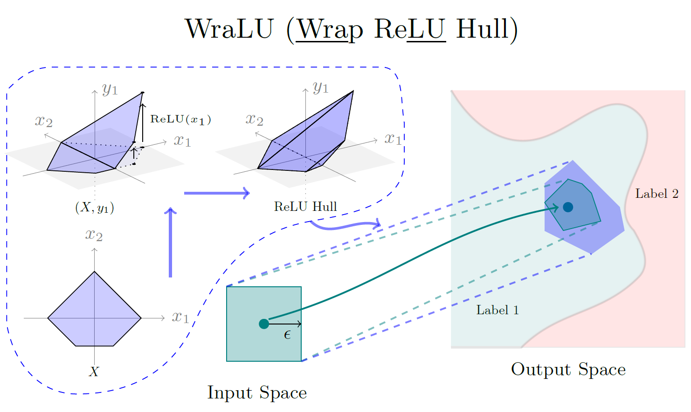

# WraLU: ReLU Hull Approximation



This is about to how to use **WraLU** to calculate the **ReLU hull** for neural network verification.

Our paper *ReLU Hull Approximation* has been accepted by 24'POPL.

```tex
@article{10.1145/3632917,
author = {Ma, Zhongkui and Li, Jiaying and Bai, Guangdong},
title = {ReLU Hull Approximation},
year = {2024},
issue_date = {January 2024},
publisher = {Association for Computing Machinery},
address = {New York, NY, USA},
volume = {8},
number = {POPL},
url = {https://doi.org/10.1145/3632917},
doi = {10.1145/3632917},
abstract = {Convex hulls are commonly used to tackle the non-linearity of activation functions in the verification of neural networks. Computing the exact convex hull is a costly task though. In this work, we propose a fast and precise approach to over-approximating the convex hull of the ReLU function (referred to as the ReLU hull), one of the most used activation functions. Our key insight is to formulate a convex polytope that ”wraps” the ReLU hull, by reusing the linear pieces of the ReLU function as the lower faces and constructing upper faces that are adjacent to the lower faces. The upper faces can be efficiently constructed based on the edges and vertices of the lower faces, given that an n-dimensional (or simply nd hereafter) hyperplane can be determined by an (n−1)d hyperplane and a point outside of it. We implement our approach as WraLU, and evaluate its performance in terms of precision, efficiency, constraint complexity, and scalability. WraLU outperforms existing advanced methods by generating fewer constraints to achieve tighter approximation in less time. It exhibits versatility by effectively addressing arbitrary input polytopes and higher-dimensional cases, which are beyond the capabilities of existing methods. We integrate WraLU into PRIMA, a state-of-the-art neural network verifier, and apply it to verify large-scale ReLU-based neural networks. Our experimental results demonstrate that WraLU achieves a high efficiency without compromising precision. It reduces the number of constraints that need to be solved by the linear programming solver by up to half, while delivering comparable or even superior results compared to the state-of-the-art verifiers.},
journal = {Proc. ACM Program. Lang.},
month = {jan},
articleno = {75},
numpages = {28},
keywords = {Robustness, Polytope, Convexity, Neural Networks}
}
```

We have integrate WraLU to PRIMA (ERAN project, https://github.com/eth-sri/eran), so the process of installation is similar to ERAN. We recommend that install it according to our guide, because they have different installation paths.

## Installation Guide

### Install WraLU

First, cd to `WraLU` directory and bash `install.sh` or manually install the necessary libraries (refer to https://github.com/eth-sri/eran).

Our core algorithm is in `WraLU/kact/krelu/sci.py`

You need to download network files from ERAN and put them in `nets/onnx`.

### Run Experiments of ReLU hull approximation

We compare different methods, including one exact method and one approximate method from the state-of-the-art technologies with our two methods.

First, you need to generate some polytope samples.

```bash
cd experiments_hull
cd polytope_samples
python3 sample_generator.py
cd ..
```

Next, calculate the bounds of variables of the polytopes samples.

```bash
cd polytope_bounds
python3 cal_polytope_bounds.py
cd ..
```

Then, we run different methods to calculate the ReLU hull.

```bash
cd output_constraints
python3 cal_constraints.py
cd ..
```

Finally, we calculate the volumes of the resulting polytopes by different methods to compare their precision.

```bash
cd volumes
python3 cal_volume.py
cd ../..
```

### Run Experiments of Neural Network Verification

In this section, we integrate our methods in PRIMA and assess its performance on neural network verification.

```bash
cd experiments
cd run_cpu
```

If you want to run a small example to test our methods.

```bash
bash example.sh
```

If you want to compare the different grouping strategies on a small network (3*50), run the following code.

```bash
bash test_hyperparameters.sh
```

If you want to run the verification on ERAN benchmarks, run the following code.

```bash
bash eran_benchmarks.sh
```

If you want to run the verification on our benchmarks, run the following code.

```bash
bash our_benchmarks.sh
```

If you want to compare with DeepZono, run the following code.

```bash
bash eran_benchmarks_deepzono.sh
```

